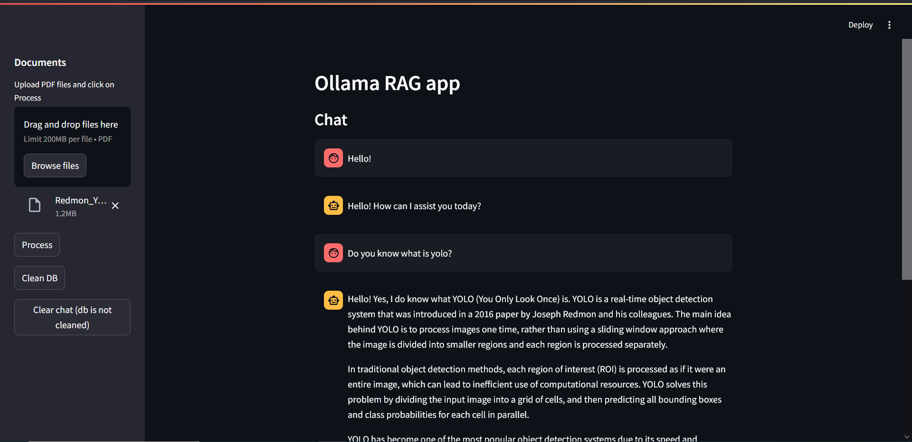

# Retrieval Augmented Generation (RAG) Project

Example:



## Contents
- [Project Overview](#project-overview)
- [Used Technologies](#used-technologies)
- [API](#api)
- [APP](#app)
- [Installation](#installation)
- [Usage](#usage)

## Project Overview
This project is an example of RAG implementation using LangChain and Ollama. It allows to load PDF files and retrieve the most relevant information from them. The project is divided into two parts: 
- API  
- APP

## Used Technologies
- LangChain
- Ollama
- ChromaDB
- Flask
- Streamlit
- Docker

## API
The API is responsible for loading the PDF files, storing them into vector database, extracting the information from them and sending the query to the LLM.
It uses LangChain and Ollama to extract the information from the PDF files and form a responce. The API is implemented using Flask. The API has the following endpoints:
1. `/ai` - to get the response from the LLM without the PDF file
    - Method: POST
    - Body: `{"query": "string"}`
    - Response: `{"response": "string"}`

2. `/load_pdf` - to load the PDF file
    - Method: POST
    - Body: `{"files": files, "session_id": "string"}`
    - Response: `{"status": "string", "filename": "string", "doc_len": "int", "chunks_len": "int"}`
3. `/ask_pdf` - to get the response from the LLM with the PDF file
    - Method: POST
    - Body: `{"session_id": "string", "query": "string"}`
    - Response: `{"response": "string", "sources": [{"source": "string", "page": "int", "page_content": "string"}]}`
4. `/clean_db` - to clean the database
    - Method: POST
    - Body: `{"session_id": "string"}`
    - Response: `{"status": "string"}`
5. `/clean_chat_history` - to clean the chat history
    - Method: POST
    - Body: `{"session_id": "string"}`
    - Response: `{"status": "string"}`


## APP 
The APP is a simple Streamlit web application that allows to interact with the API. It has the following features:
1. Load PDF file with 
2. Ask a question and get the response
3. Clean the chat history
4. Clean the database

### Installation
1. Clone the repository 
```
git clone https://github.com/Glekk/rag-ollama-project.git
cd rag-ollama-project
```
2. Install the requirements
- of the whole project
```
pip install -r requirements.txt
```
OR
- explicitly for the API
```
pip install -r api/requirements.txt
```
- explicitly for the APP
```
pip install -r app/requirements.txt
```

## Usage
1. If you want to run it locally, you would need to run the API and the APP separately. And as prerequisites, you would need to have Ollama installed and running.  
    - You can install Ollama from [official website](https://ollama.com/).  
    - After you have installed Ollama, you need to download model and start the server (in my case i downloaded llama3.2, however, you can download any other model, but you would need to change the model name in the `api/api_config.yaml` file):

    ```
    ollama pull llama3.2
    ollama serve
    ```
    - After you have installed Ollama and started the server, you can run the API:
    ```
    cd api
    python app.py
    ```
    and the APP:
    ```
    cd app
    streamlit run app.py
    ```
    - After the API and the APP are up and running, you can access the APP by going to `http://localhost:8501/` in your browser.
    - You can also access the API by via `http://localhost:8080/{endpoint}` in your browser.

2. If you want to run it using Docker, you would need to have Docker installed. You can install Docker from [official website](https://www.docker.com/).
    - After you have installed Docker, you can run the following command while being in the root directory of the project:
    ```
    docker-compose up
    ```
    - After the containers are up and running, you can access the APP by going to `http://localhost:8501/` in your browser.